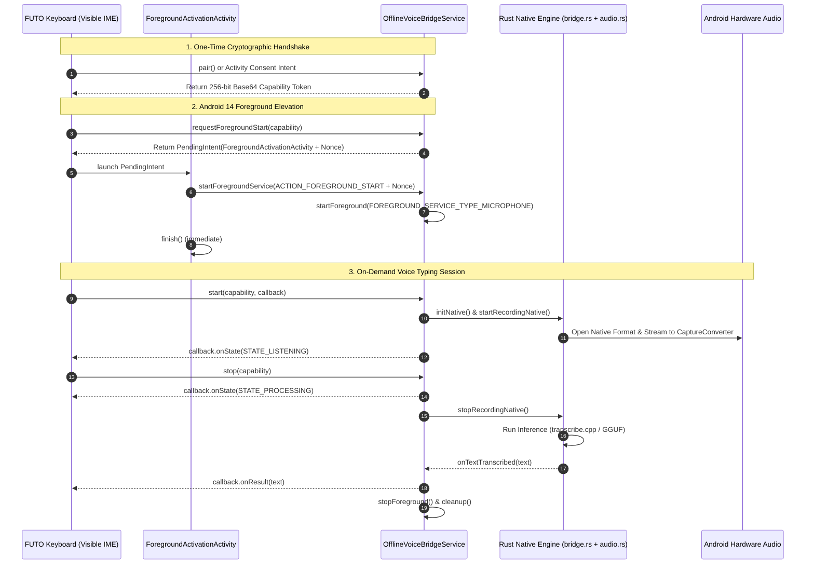

# Android FreeSpeech: Forks, References, and Inspirations

This document catalogs the upstream forks, comparison URLs, and reference repositories curated to guide the development, debugging, and evolution of **Android FreeSpeech** (`https://github.com/NairoDorian/Android_FreeSpeech`).

---

## 1. Upstream Comparison References

| Fork / Author | Comparison URL | Primary Contributions & Focus |
|---|---|---|
| **caminante-blanco** | [Compare with upstream main](https://github.com/notune/android_transcribe_app/compare/main...caminante-blanco:android_transcribe_app:main) | Real-time streaming support for Moonshine and Nemotron models; CI build improvements skipping signing when secrets are absent. |
| **dmtnndxr** | [Compare with upstream main](https://github.com/notune/android_transcribe_app/compare/main...dmtnndxr:android_transcribe_app:main) | Optional LLM post-processing of transcriptions (AI cleanup via OpenRouter/API); portable NDK host path detection (Windows/macOS/Linux); independently installable Plus build. |
| **classic-ally** | [Compare with upstream main](https://github.com/notune/android_transcribe_app/compare/main...classic-ally:android_transcribe_app:main) | Opt-in live streaming preview to the voice keyboard; discard button and configurable preview refresh interval. |
| **dscho** | [Compare with upstream main](https://github.com/notune/android_transcribe_app/compare/main...dscho:android_transcribe_app:main) | IME streaming dictation rendered as composing text (`InputConnection.setComposingText`); `android.speech.RecognitionService` implementation; R8 release minification. |
| **mw-el (TRANSKRIPT)** | [Compare with upstream main](https://github.com/notune/android_transcribe_app/compare/main...mw-el:TRANSKRIPT:main) | Complete Anthropic/Claude-inspired UI redesign; dedicated audio file transcription with chunk decoding (avoiding Java-heap OOM); DictateActivity with waveform; recordings manager; offline TTS via Sherpa-ONNX + Thorsten-Medium (Piper VITS); Voice Chat mode; multi-language post-processing. |
| **Nicfox77** | [Compare with upstream main](https://github.com/notune/android_transcribe_app/compare/main...Nicfox77:android_transcribe_app:main) | Inspectable streaming IME builds, self-reporting CI workflows, and PR verification builds. |
| **arthow4n** | [Compare with upstream main](https://github.com/notune/android_transcribe_app/compare/main...arthow4n:android_transcribe_app:main) | Traditional Chinese language conversion (Taiwan); keyboard streaming dictation with live speed/WPM stats; configurable filler word filter and punctuation cleanup; buffered streaming dictation with Parakeet Unified EN; model memory per language. |
| **space-shell (nemotron-voice-input)** | [Compare with upstream main](https://github.com/notune/android_transcribe_app/compare/main...space-shell:nemotron-voice-input:main) | Migration to `transcribe-cpp 0.2.3`; per-run `Session` architecture with lock-free channel audio feeding; floating keyboard mode with insets fix; microphone foreground service (FGS) for background recording; survival of freezer cold-restarts; FFI hardening (`catch_unwind`, no aborts on JNI error, `SendStream`). |
| **djurcola (stable-test-signing)** | [Compare with upstream main](https://github.com/notune/android_transcribe_app/compare/main...djurcola:android_transcribe_app:agent/stable-test-signing) | Production-hardened FUTO Keyboard voice bridge on branch [`agent/stable-test-signing`](https://github.com/djurcola/android_transcribe_app/tree/agent/stable-test-signing). Adds Android 14 foreground activation dispatching (`ForegroundActivationActivity` + nonce validation), native CPAL audio context bootstrapping (`NativeContextBootstrap`), dynamic sample rate / channel format negotiation with continuous linear resampling (`CaptureConverter`), floating voice bubble overlay (`BubbleService`), accessibility direct text insertion (`InsertionAccessibilityService`), Whisper vocabulary prompt biasing (`CustomWordsPrefs`), SQLite transcription history (`TranscriptionHistory`), and CI shared test keystore signing. |

---

## 2. Deep Dive: FUTO Voice Bridge & Universal Dictation Architecture (djurcola)

The `djurcola/android_transcribe_app` fork (branch [`agent/stable-test-signing`](https://github.com/djurcola/android_transcribe_app/tree/agent/stable-test-signing), evolved from `agent/futo-voice-bridge`) introduces a comprehensive architectural suite designed to solve two core challenges in mobile offline voice dictation:
1. **FUTO Keyboard Integration Without Vendor Lock-In**: FUTO Keyboard provides built-in voice input, but bundles its own proprietary or nagware-licensed Whisper models. Users who prefer open-source GGUF/transcribe.cpp models (Whisper, Moonshine, Parakeet, R2T2) previously had to cycle through the Android IME switcher away from FUTO Keyboard.
2. **Universal Dictation Across Any App/Keyboard**: Rather than requiring every keyboard to support a specific voice protocol, an independent floating bubble can capture speech and paste it safely into whatever input field is focused.

### 2.1 The AIDL Binder IPC Protocol

The bridge exposes an on-demand, authenticated Binder IPC service (`dev.notune.transcribe.OfflineVoiceBridgeService`):

```aidl
// IOfflineVoiceBridge.aidl
package dev.notune.transcribe;

import android.app.PendingIntent;
import dev.notune.transcribe.IOfflineVoiceBridgeCallback;

interface IOfflineVoiceBridge {
    String pair();
    PendingIntent requestForegroundStart(String capability);
    boolean isForegroundReady(String capability);
    void start(String capability, IOfflineVoiceBridgeCallback callback);
    void stop(String capability);
    void cancel(String capability);
    boolean isPaired(String capability);
}
```

```aidl
// IOfflineVoiceBridgeCallback.aidl
package dev.notune.transcribe;

interface IOfflineVoiceBridgeCallback {
    void onState(int state);       // 1 = STARTING, 2 = LISTENING, 3 = PROCESSING
    void onResult(String text);     // Final transcribed text delivered directly to FUTO
    void onError(int code, String userMessage);
}
```

### 2.2 Cryptographic Pairing and Security Model

To prevent arbitrary third-party apps from hijacking the microphone or reading transcription buffers:
- **Caller UID Verification**: Every Binder transaction checks `Binder.getCallingUid()` and verifies the caller's package name via `PackageManager.getPackagesForUid()`.
- **Package Pinning**: The bridge explicitly pins `org.futo.inputmethod.latin.unstable` (or the stable FUTO package).
- **Capability Tokens**: Pairing generates a 256-bit cryptographically secure token (`BridgePairingStore.createCapability()` using `SecureRandom` and URL-safe Base64 without padding).
- **Constant-Time Comparison**: Token checks use `MessageDigest.isEqual(...)` to guard against side-channel timing attacks.
- **Bi-Directional Handshake**:
  - `MainActivity.beginFutoPairing()` initiates an explicit intent to `org.futo.inputmethod.latin.uix.actions.OfflineVoiceBridgePairingActivity` passing `PAIRING_CAPABILITY` and an `android-app://` referrer.
  - When approved by the user inside FUTO Keyboard's UI, `PAIRING_ACCEPTED` is returned, and both sides persist the capability.
  - Alternatively, FUTO Keyboard can invoke `pair()` directly over Binder if its calling UID matches the pinned package.

### 2.3 Resilient Microphone, Android 14 Foreground Elevation & Native Lifecycle

- **Android 14 Foreground Microphone Eligibility Trampoline**:
  - On Android 14+ (API 34), a background process cannot start a foreground service with `FOREGROUND_SERVICE_TYPE_MICROPHONE` without having a visible activity or caller foreground delegation (`ForegroundServiceStartNotAllowedException`).
  - `OfflineVoiceBridgeService` solves this via `requestForegroundStart(capability)`: it generates a cryptographically random 32-byte nonce (with a time-to-live) and packages it into a `PendingIntent` pointing to a transparent 1-shot activity (`ForegroundActivationActivity`).
  - FUTO Keyboard (which has foreground privilege while the keyboard is displayed) executes the `PendingIntent`. In `onPostResume()`, `ForegroundActivationDispatcher` dispatches `ACTION_FOREGROUND_START` with the nonce to the bridge service and finishes itself immediately without flickering.
  - This guarantees legitimate, crash-free microphone elevation across all Android versions.
- **Native Context Bootstrap (`NativeContextBootstrap.java` & `src/android_context.rs`)**:
  - Initializes Android runtime context in native Rust via `ndk_context::initialize_android_context(vm, application_context)`. This is essential for CPAL / AAudio / AudioRecord to function reliably when invoked outside the main activity.
- **Dynamic Capture Format Negotiation & Stateful Resampling (`src/audio.rs`)**:
  - Instead of hardcoding 16 kHz mono capture (which fails or degrades on devices with fixed 44.1 kHz/48 kHz hardware pipelines), `select_input_format` queries `device.supported_input_configs()`, clamps to the supported hardware rates, and uses `CaptureConverter` for continuous linear resampling and downmixing to 16 kHz.
- **Death Recipient Binding**: Attaches `callbackBinder.linkToDeath(...)`. If FUTO Keyboard crashes, is killed by LMK, or unbinds, the bridge immediately cancels recording, stops audio capture, removes the foreground notification, and unloads native state.
- **Session Watchdog**: A strict 60-second timer (`MAX_SESSION_MS = 60_000L`) automatically aborts stuck sessions to prevent battery drain.
- **Isolated Native Bridge State (`src/bridge.rs`)**: Maintains its own static `BRIDGE_STATE: Mutex<Option<VoiceSessionState>>`, completely decoupled from the IME and dialog popup lifecycles.
- **Shared Test Keystore Signing**: The `agent/stable-test-signing` branch adds automated test artifact signing in CI so test builds can be upgraded seamlessly without uninstalling.



### 2.4 Companion Dictation Subsystems in `djurcola`

Beyond the FUTO Binder bridge, `djurcola` introduces three key features:

1. **Floating Voice Bubble (`BubbleService.java` & `src/bubble.rs`)**:
   - System overlay window (`TYPE_APPLICATION_OVERLAY`) that remains accessible over any app.
   - Micro-state indicators (Idle, Recording, Processing, Loading) and draggable positioning with coordinate persistence.
   - **Battery-Aware Idle Model Unloading**: Configurable timer (e.g. 5, 15, 30 min) drops heavy model weights from RAM while keeping the overlay active. The next tap automatically reloads asynchronously without UI freezing.
2. **Safe Direct Text Insertion via Accessibility (`InsertionAccessibilityService.java`)**:
   - When transcription finishes, text is immediately placed on the Android clipboard.
   - Locates the active focused input node (`AccessibilityNodeInfo.FOCUS_INPUT`).
   - Validates that the input is editable, visible, and **NOT a password/PIN field** (`TYPE_TEXT_VARIATION_PASSWORD`, `TYPE_NUMBER_VARIATION_PASSWORD`, etc.).
   - Dispatches `AccessibilityNodeInfo.ACTION_PASTE` to paste text cleanly at the cursor without modifying or reading existing buffer contents.
3. **Custom Words Vocabulary Prompt Biasing (`CustomWordsPrefs.java` & `src/engine.rs`)**:
   - Users can maintain a dictionary of technical terms, proper nouns, and foreign words (up to 200 entries, 60 characters max).
   - Saved as `filesDir/custom_words` and passed directly into Whisper model inference as `initial_prompt: Some(custom_words.join(", "))`, dramatically reducing Word Error Rate (WER) on domain-specific vocabulary.
4. **Local SQLite Transcription History (`TranscriptionHistory.java` & `HistoryActivity.java`)**:
   - Stores `_id`, `text`, `source` (`bubble`, `ime`, `popup`, `file`, `service`), and `timestamp`.
   - Includes automatic retention pruning (e.g., 7 days, 30 days, forever) and a search/copy UI.

---

## 3. Phone Call Recording Reference: ShizuCallRecorder

- **Repository**: [https://github.com/kitsumed/ShizuCallRecorder](https://github.com/kitsumed/ShizuCallRecorder)
- **Local clone**: `reference_repos/ShizuCallRecorder`
- **Core Technology**:
  - Leverages **Shizuku** (ADB IPC service) to execute privileged shell commands on non-rooted Android devices.
  - Spawns and manages **scrcpy-server** via ADB shell to capture the device's internal playback / submix / microphone audio streams, bypassing Android 10+ restrictions on the `VOICE_CALL` audio source.
  - Uses `ScrcpyClient`, `ScrcpyAudioSource`, and `ScrcpyAudioMuxer` to stream and record clean call audio without requiring root access.
- **Vision for Android FreeSpeech**:
  - In a future phase, adapt and modernize the Shizuku/scrcpy audio capture subsystem.
  - Pipe real-time call audio directly into the native STT engine (`transcribe.cpp` / R2T2) to provide **live call transcription, instant captions, and automated post-call meeting notes/summaries**, completely offline and private.

---

## 4. FUTO Keyboard Counterpart Fork: djurcola/android-keyboard

- **Repository**: [https://github.com/djurcola/android-keyboard](https://github.com/djurcola/android-keyboard/tree/custom/gif-and-swipe)
- **Comparison with upstream FUTO**: [Compare `futo-org:master` vs `djurcola:custom/gif-and-swipe`](https://github.com/futo-org/android-keyboard/compare/master...djurcola:android-keyboard:custom/gif-and-swipe)
- **Local clone**: `reference_repos/android-keyboard` (branch `custom/gif-and-swipe`)
- **Direct Connection to Android FreeSpeech / Offline Voice Input**:
  - This is the **exact counterpart repository** to `djurcola/android_transcribe_app`. It implements the client-side voice backend switching and integration within FUTO Keyboard itself.
  - **External Voice Backend Whitelist**: In commit `1525717f2`, `VoiceInputMenu` adds a dropdown picker (`SYSTEM_VOICE_INPUT_PACKAGE`) that allows users to route voice typing directly to external offline speech recognition providers instead of FUTO's proprietary internal Whisper models.
  - **Explicit FreeSpeech Support**: The privacy whitelist specifically includes:
    ```kotlin
    val privacyWhitelist = listOf(
        "org.futo.voiceinput",
        "org.futo.voiceinput.dev",
        "dev.notune.transcribe",      // Android FreeSpeech / Offline Voice Input
        "dev.soupslurpr.transcribro"
    )
    ```
  - **Shared CI Test Keystore Signing**: Integrates PR #4 (`djurcola/agent/stable-test-signing`, commit `bff1a0ccf`), sharing the same signing keystore and release pipeline as `djurcola/android_transcribe_app:agent/stable-test-signing` so test APKs of both FUTO Keyboard and FreeSpeech can be installed concurrently and interact with matching signatures.
  - **Additional Enhancements in `custom/gif-and-swipe`**: Word recapitalization at cursor (via Shift swipe gestures), dictionary suggestion additions, long-press Russian 'ie' support, and optimized GIF & swipe animations.

---

## 5. Local Clones Layout

All reference repositories have been cloned locally for direct inspection, diffing, and code extraction:

```
Android_FreeSpeech/
├── other_forks/
│   ├── caminante-blanco/
│   ├── classic-ally/
│   ├── djurcola/
│   ├── dmtnndxr/
│   ├── dscho/
│   ├── mw-el/
│   ├── Nicfox77/
│   ├── arthow4n/
│   └── space-shell/
├── reference_repos/
│   ├── ShizuCallRecorder/
│   └── android-keyboard/
└── docs/
    ├── FORKS_AND_REFERENCES.md
    ├── UPSTREAM_PRS_REFERENCE.md
    ├── TRANSCRIBE_CPP_MIGRATION_PLAN.md
    ├── R2T2_INTEGRATION_PLAN.md
    └── CALL_RECORDING_STT_ARCHITECTURE.md
```

*(Note: `other_forks/` and `reference_repos/` are ignored in `.gitignore` so they remain on disk for developer reference without bloating the main Git repository).*

