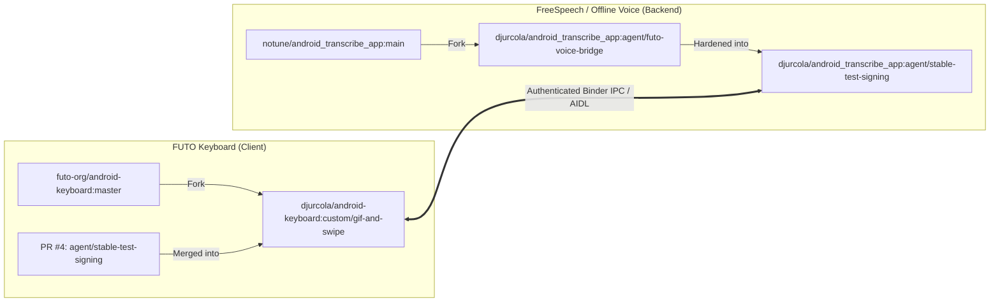
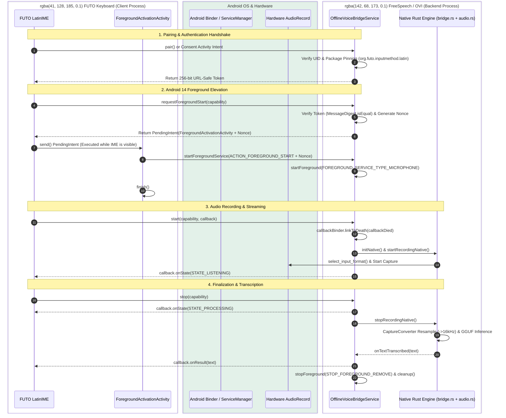

# The FUTO Situation: Architectural Breakdown & Fork Analysis

This document provides a comprehensive architectural and operational breakdown of the **"FUTO Situation"** — the integration between **FUTO Keyboard** and **Android FreeSpeech / Offline Voice Input (`android_transcribe_app`)**, created and refined across the repositories and branches maintained by **`djurcola`**.

---

## 1. Executive Summary & The Problem Statement

### 1.1 What is FUTO Keyboard?
[FUTO Keyboard](https://github.com/futo-org/android-keyboard) is an open-source on-device keyboard for Android developed by FUTO (derived from AOSP LatinIME). It features glide typing, modern Jetpack Compose settings, and a dedicated microphone button for voice dictation.

### 1.2 The Conflict: "The FUTO Situation"
While FUTO Keyboard is positioned as a private, on-device typing tool, its voice typing story presents severe limitations for open-source and privacy advocates:
1. **Proprietary & Nagware Voice Engine**: By default, FUTO Keyboard bundles its own voice input engine ("FUTO Voice Input"). Although it runs on-device, it is distributed under a proprietary, non-FOSS license with periodic payment nag screens and trial expiration notices.
2. **Vendor Model Lock-In**: FUTO's voice engine only operates with FUTO-packaged voice models. It cannot load modern open-source GGUF speech models, Moonshine, Nemotron, or Confucius4-R2T2 via [`transcribe.cpp`](https://github.com/NairoDorian/transcribe.cpp).
3. **The IME Switching Dilemma**: Previously, the only way a user could transcribe speech using a genuinely free, open-source model (such as `android_transcribe_app` / Android FreeSpeech) was to open Android's system IME switcher dialog, switch completely away from FUTO Keyboard to the voice keyboard, record speech, and switch back. This disrupted typing flow and degraded user experience.

### 1.3 The Solution Engineered by `djurcola`
Developer **`djurcola`** engineered a two-pronged solution across both sides of the ecosystem:
1. **On the Speech Backend (`android_transcribe_app`)**: Built an authenticated Android Binder IPC bridge ([`IOfflineVoiceBridge.aidl`](file:///c:/Users/Z/Downloads/PROJECTS/Android_FreeSpeech/other_forks/djurcola/app/src/main/aidl/dev/notune/transcribe/IOfflineVoiceBridge.aidl)), cryptographic token pairing, Android 14 foreground microphone elevation trampolines, and isolated native audio capture.
2. **On the Keyboard Client (`android-keyboard`)**: Modified FUTO Keyboard to provide an external voice provider selector with an explicit privacy whitelist for `dev.notune.transcribe` (FreeSpeech), alongside gesture-based recapitalization and shared CI signing infrastructure.

---

## 2. Repositories and Specific Branches



### 2.1 Backend Repository: `djurcola/android_transcribe_app`
- **Upstream**: [`notune/android_transcribe_app`](https://github.com/notune/android_transcribe_app)
- **Local Clone**: `other_forks/djurcola`
- **Branches**:
  1. [`agent/futo-voice-bridge`](https://github.com/djurcola/android_transcribe_app/tree/agent/futo-voice-bridge) ([Upstream Compare](https://github.com/notune/android_transcribe_app/compare/main...djurcola:android_transcribe_app:agent/futo-voice-bridge)): Initial implementation of the AIDL service (`IOfflineVoiceBridge`), token pairing handshake, floating bubble overlay (`BubbleService`), accessibility auto-paste (`InsertionAccessibilityService`), custom words bias (`CustomWordsPrefs`), and SQLite history (`TranscriptionHistory`).
  2. [`agent/stable-test-signing`](https://github.com/djurcola/android_transcribe_app/tree/agent/stable-test-signing) ([Upstream Compare](https://github.com/notune/android_transcribe_app/compare/main...djurcola:android_transcribe_app:agent/stable-test-signing)): **Current production-hardened branch**. Adds Android 14 `PendingIntent` foreground elevation trampolines (`ForegroundActivationActivity`), CPAL native context bootstrap (`NativeContextBootstrap`), dynamic hardware capture rate resampling (`CaptureConverter` in `src/audio.rs`), and shared CI test keystore signing.

### 2.2 Client Repository: `djurcola/android-keyboard`
- **Upstream**: [`futo-org/android-keyboard`](https://github.com/futo-org/android-keyboard)
- **Local Clone**: `reference_repos/android-keyboard`
- **Branches**:
  1. [`custom/gif-and-swipe`](https://github.com/djurcola/android-keyboard/tree/custom/gif-and-swipe) ([Upstream Compare](https://github.com/futo-org/android-keyboard/compare/master...djurcola:android-keyboard:custom/gif-and-swipe)): Main fork branch containing the external voice input selector, whitelisting for `dev.notune.transcribe`, Shift gesture recapitalization, and UI refinements.
  2. [`agent/stable-test-signing`](https://github.com/djurcola/android-keyboard/tree/agent/stable-test-signing): Merged via **PR #4** (commit `bff1a0ccf`), introducing the exact counterpart CI test keystore configuration to match `android_transcribe_app`.

---

## 3. The Evolutionary Phases of the Integration

Inspection of the Git commit trajectories reveals three distinct engineering phases:

### Phase 1: Direct `SpeechRecognizer` Injection (Exploratory)
In commits `e2d9cdd88`, `47583a635`, and `e6276ab0e` of `android-keyboard`:
- `djurcola` altered FUTO's `SystemVoiceInputAction.kt` to bind directly to `dev.notune.transcribe.VoiceRecognitionService` via `SpeechRecognizer.createSpeechRecognizer(context, ComponentName("dev.notune.transcribe", ...))`.
- **Limitation**: This hardcoding broke voice input completely if the user had not installed `dev.notune.transcribe`, caused lifecycle conflicts, and failed to pass custom parameters cleanly.
- **Outcome**: Reverted in commit `bf49090fc` (*"revert: restore standard system voice input (#2)"*).

### Phase 2: User-Selectable Voice Backend & Privacy Whitelist
In commit `1525717f2` (*"Allow setting specific voice input app"*) in `android-keyboard`:
- Replaced hardcoding with a user setting in `VoiceInput.kt`:
  ```kotlin
  // java/src/org/futo/inputmethod/latin/uix/settings/pages/VoiceInput.kt
  val privacyWhitelist = listOf(
      "org.futo.voiceinput",
      "org.futo.voiceinput.dev",
      "dev.notune.transcribe",      // Android FreeSpeech / Offline Voice Input
      "dev.soupslurpr.transcribro"
  )
  ```
- FUTO Keyboard queries `InputMethodManager.enabledInputMethodList`, filters for voice subtypes, and provides a clean dropdown picker. If `dev.notune.transcribe` is selected, FUTO trusts it without displaying third-party security warnings.

### Phase 3: The Dedicated Authenticated Binder Bridge & Android 14 Trampoline
Rather than relying solely on Android's generic `SpeechRecognizer` API (which lacks fine-grained stream state, custom cancellation tokens, and model state reporting), `djurcola` designed an explicit AIDL Binder service in `android_transcribe_app`.

---

## 4. End-to-End Architectural Deep Dive



### 4.1 The AIDL Binder Contract
Defined in [`IOfflineVoiceBridge.aidl`](file:///c:/Users/Z/Downloads/PROJECTS/Android_FreeSpeech/other_forks/djurcola/app/src/main/aidl/dev/notune/transcribe/IOfflineVoiceBridge.aidl) and [`IOfflineVoiceBridgeCallback.aidl`](file:///c:/Users/Z/Downloads/PROJECTS/Android_FreeSpeech/other_forks/djurcola/app/src/main/aidl/dev/notune/transcribe/IOfflineVoiceBridgeCallback.aidl):

```aidl
package dev.notune.transcribe;

import android.app.PendingIntent;
import dev.notune.transcribe.IOfflineVoiceBridgeCallback;

interface IOfflineVoiceBridge {
    String pair();
    PendingIntent requestForegroundStart(String capability);
    boolean isForegroundReady(String capability);
    void start(String capability, IOfflineVoiceBridgeCallback callback);
    void stop(String capability);
    void cancel(String capability);
    boolean isPaired(String capability);
}

interface IOfflineVoiceBridgeCallback {
    void onState(int state);       // 1 = STARTING, 2 = LISTENING, 3 = PROCESSING
    void onResult(String text);     // Transcribed text committed directly to keyboard
    void onError(int code, String userMessage);
}
```

### 4.2 Security Architecture & Cryptographic Pairing
Located in [`BridgePairingStore.java`](file:///c:/Users/Z/Downloads/PROJECTS/Android_FreeSpeech/other_forks/djurcola/app/src/main/java/dev/notune/transcribe/BridgePairingStore.java) and [`BridgeAuthorization.java`](file:///c:/Users/Z/Downloads/PROJECTS/Android_FreeSpeech/other_forks/djurcola/app/src/main/java/dev/notune/transcribe/BridgeAuthorization.java):
1. **Calling UID Verification**: On every Binder invocation, `OfflineVoiceBridgeService` checks `Binder.getCallingUid()` and queries `PackageManager.getPackagesForUid(uid)`.
2. **Package Pinning**: The bridge validates that caller package equals `org.futo.inputmethod.latin.unstable` or `org.futo.inputmethod.latin`.
3. **256-Bit Unpadded Capability Token**: `SecureRandom` generates a 32-byte cryptographic token encoded as URL-safe Base64 without padding.
4. **Timing-Attack Resistance**: `BridgeAuthorization.isAuthorized` compares stored and supplied capability tokens using `MessageDigest.isEqual(...)` in constant time, preventing side-channel token discovery.

### 4.3 Android 14 Foreground Elevation Trampoline
On Android 14+ (API 34), a background service cannot elevate itself to `FOREGROUND_SERVICE_TYPE_MICROPHONE` without throwing `ForegroundServiceStartNotAllowedException`. Since FreeSpeech is a background service when FUTO Keyboard is on screen, standard `startForeground()` calls fail.

**The Trampoline Solution**:
1. When FUTO prepares to record, it calls `requestForegroundStart(capability)`.
2. FreeSpeech issues a single-use 32-byte nonce (with TTL) and returns a `PendingIntent` for [`ForegroundActivationActivity.java`](file:///c:/Users/Z/Downloads/PROJECTS/Android_FreeSpeech/other_forks/djurcola/app/src/main/java/dev/notune/transcribe/ForegroundActivationActivity.java).
3. FUTO Keyboard (which has foreground status as the active window IME) launches the `PendingIntent`.
4. `ForegroundActivationActivity` (a transparent 1x1 activity) resumes for a fraction of a millisecond. In `onPostResume()`, [`ForegroundActivationDispatcher`](file:///c:/Users/Z/Downloads/PROJECTS/Android_FreeSpeech/other_forks/djurcola/app/src/main/java/dev/notune/transcribe/ForegroundActivationDispatcher.java) dispatches `ACTION_FOREGROUND_START` with the nonce to `OfflineVoiceBridgeService`.
5. Because the service start originated from a visible, resumed activity, Android grants foreground microphone eligibility immediately.
6. The activity immediately calls `finish()`, resulting in zero screen flicker.

### 4.4 Native Audio Context & Robust Dynamic Resampling
- **Context Bootstrap**: [`NativeContextBootstrap.java`](file:///c:/Users/Z/Downloads/PROJECTS/Android_FreeSpeech/other_forks/djurcola/app/src/main/java/dev/notune/transcribe/NativeContextBootstrap.java) passes the `applicationContext` down to native code via [`src/android_context.rs`](file:///c:/Users/Z/Downloads/PROJECTS/Android_FreeSpeech/other_forks/djurcola/src/android_context.rs) using `ndk_context::initialize_android_context`. This prevents CPAL and AAudio crashes when recording from non-activity processes.
- **Dynamic Capture Selection & Resampling**: In [`src/audio.rs`](file:///c:/Users/Z/Downloads/PROJECTS/Android_FreeSpeech/other_forks/djurcola/src/audio.rs), `select_input_format()` inspects the device's native hardware rates (clamping between min and max supported rates, e.g. 48 kHz or 44.1 kHz), and `CaptureConverter` performs continuous linear interpolation downmixing to 16 kHz mono.
- **Isolated Native Bridge State**: [`src/bridge.rs`](file:///c:/Users/Z/Downloads/PROJECTS/Android_FreeSpeech/other_forks/djurcola/src/bridge.rs) stores `BRIDGE_STATE: Lazy<Mutex<Option<VoiceSessionState>>>`, guaranteeing that bridge recording runs independently of the IME service or floating bubble.

### 4.5 Death Recipients & 60s Watchdog
- `callbackBinder.linkToDeath(callbackDied, 0)`: If FUTO Keyboard crashes, is killed by Android's Low Memory Killer (LMK), or unbinds, the bridge immediately cancels recording, terminates audio streams, and removes the ongoing notification.
- Strict 60-second watchdog (`MAX_SESSION_MS = 60_000L`) to prevent orphaned sessions from draining battery.

---

## 5. Companion Innovations in the `djurcola` Stack

In addition to the FUTO Bridge, `djurcola` introduced several foundational features across these forks:

| Feature | Primary Files | Functionality |
|---|---|---|
| **Floating Voice Bubble** | [`BubbleService.java`](file:///c:/Users/Z/Downloads/PROJECTS/Android_FreeSpeech/other_forks/djurcola/app/src/main/java/dev/notune/transcribe/BubbleService.java), `src/bubble.rs` | System overlay (`TYPE_APPLICATION_OVERLAY`) enabling universal one-tap dictation over any app. Includes battery-aware idle unloading (drops heavy GGUF models after 5–30 min idle while keeping the bubble responsive). |
| **Accessibility Safe Insertion** | [`InsertionAccessibilityService.java`](file:///c:/Users/Z/Downloads/PROJECTS/Android_FreeSpeech/other_forks/djurcola/app/src/main/java/dev/notune/transcribe/InsertionAccessibilityService.java) | Direct text pasting into focused fields via `AccessibilityNodeInfo.ACTION_PASTE`. Verifies fields to **strictly avoid password and PIN inputs** (`TYPE_TEXT_VARIATION_PASSWORD`, etc.). |
| **Custom Words Prompt Biasing** | [`CustomWordsPrefs.java`](file:///c:/Users/Z/Downloads/PROJECTS/Android_FreeSpeech/other_forks/djurcola/app/src/main/java/dev/notune/transcribe/CustomWordsPrefs.java), `src/engine.rs` | User-defined dictionary of technical terms and names (up to 200 words) passed as `initial_prompt: Some(custom_words.join(", "))` to Whisper models, sharply reducing Word Error Rate (WER). |
| **Local SQLite Transcription History** | [`TranscriptionHistory.java`](file:///c:/Users/Z/Downloads/PROJECTS/Android_FreeSpeech/other_forks/djurcola/app/src/main/java/dev/notune/transcribe/TranscriptionHistory.java), `HistoryActivity.java` | Local, indexed SQLite history logging all dictations (`bubble`, `ime`, `popup`, `service`, `file`) with automated retention cleanup. |
| **Shift Recapitalization** | `android-keyboard` (`custom/gif-and-swipe`) | Instant casing toggle (lowercase -> Capitalized -> UPPERCASE) for words at cursor via Shift swipe gestures. |

---

## 6. Shared CI Test Signing Infrastructure

A major hurdle in pairing two independently built development apps on Android is signature mismatch and permissions. In `agent/stable-test-signing`, `djurcola` synchronized the CI build environments of both repositories:

- **FreeSpeech / OVI**: `.github/workflows/android_release.yml` decodes `ANDROID_TEST_KEYSTORE_B64` and signs release artifacts.
- **FUTO Keyboard**: `.github/workflows/build-custom-gif-and-swipe-apk.yml` decodes the exact same keystore secret to sign `android-keyboard-unstable-debug.apk`.
- **Result**: APKs built from GitHub Actions on both repositories share identical signatures, allowing smooth testing, cross-app IPC, and continuous update installations.

---

## 7. Strategic Recommendations for Android FreeSpeech

For **Android FreeSpeech** (`https://github.com/NairoDorian/Android_FreeSpeech`), these findings provide a clear engineering blueprint:

1. **Adopt the Android 14 Elevation Trampoline**:
   Incorporate `ForegroundActivationActivity` and `ForegroundActivationDispatcher` into FreeSpeech to prevent `ForegroundServiceStartNotAllowedException` during background voice sessions.
2. **Integrate Native Context Bootstrapping**:
   Bring `NativeContextBootstrap` and `src/android_context.rs` into the FreeSpeech codebase to ensure CPAL / AAudio initialization is rock-solid across all Android versions.
3. **Bridge Support for Confucius4-R2T2 Streaming**:
   Extend `IOfflineVoiceBridgeCallback.aidl` with `onPartialResult(String text)` so that FUTO Keyboard can display live streaming transcriptions from our newly integrated `transcribe.cpp` R2T2 model.
4. **Preserve Compatibility with FUTO's `privacyWhitelist`**:
   Keep our application package or alias aligned with `dev.notune.transcribe` (or provide compatibility intents) so FUTO Keyboard users can plug in FreeSpeech without friction.
