# Comprehensive Engineering Plan: R2T2 Native Streaming Mode for Android FreeSpeech

---

## Executive Summary

This specification establishes the production engineering roadmap to implement end-to-end **Native Streaming Dictation** using the **Confucius4-R2T2** model (`Nairod785/Confucius4-R2T2-Q4_K_M-GGUF`) and the `transcribe.cpp` engine (`v0.2.3+`, commit `cf9c6013`) across all surfaces of **Android FreeSpeech** (`https://github.com/NairoDorian/Android_FreeSpeech`).

By synthesizing breakthroughs across open-source forks:
- **`caminante-blanco`**: Direct `transcribe_cpp::Session::stream` continuous channel feeding, partial publishing, and composing text cleanup.
- **`dscho`**: Composing text mechanics (`setComposingText`), monotonic generation token fencing (`streamGeneration`), atomic batch edit finalization, and `select_transcription` bounds recovery.
- **`space-shell`**: GGML kernel silent warmup pass (200 ms silence), channel capacity expansion (`CHANNEL_CHUNKS = 256`), dynamic audio backlog trimming (`BACKLOG_TRIM_SAMPLES = 48000`), Samsung freezer lifecycle survival (`cancel_recording` on cleanup), and screen keep-awake (`setKeepScreenOn`).
- **`classic-ally`**: Dedicated discard button (`✕`) to abort dictation without committing, and configurable streaming refresh cadence slider.
- **`arthow4n`**: Real-time words-per-minute (WPM) telemetry, and punctuation/filler word cleanup.
- **`djurcola`**: System `RecognitionService` partial hypothesis broadcasting and FUTO voice bridge AIDL IPC.

This plan upgrades Android FreeSpeech from a predominantly batch-oriented or single-surface IME into a **unified real-time streaming speech suite** covering the **IME Keyboard**, **Live Subtitles**, **System Recognition Service**, **Voice Popup**, and **FUTO Voice Bridge**.

---

## 1. Architectural Matrix: Fork Innovations vs. FreeSpeech Implementation

| Engineering Domain | Upstream / Fork Inspiration | Technical Mechanism | FreeSpeech R2T2 Target Implementation |
|---|---|---|---|
| **Engine Session & Warmup** | `space-shell` (`6c26344`, `911c12b`) | Pre-feeds 200 ms silence (`WARMUP_SAMPLES = 3200`) before live audio. | Eliminates the 800–1200 ms cold-start lag when unfreezing GGML kernels on Android SoCs. |
| **Backlog & Queue Resiliency** | `space-shell` (`6c26344`) | Expanded `bounded(256)` channel + backlog trim at 48k samples. | Prevents channel overflows during AAudio thread bursts; trims old audio to keep real-time sync. |
| **IME Composing Text** | `dscho` (`c1156a3`), `caminante-blanco` (`eeb3ece`) | `ic.setComposingText()` for intermediate partials; atomic replace. | Replaces intermediate hypotheses atomically; eliminates duplicate text ("bag bank"). |
| **Visual Hypothesis Styling** | Modern IME Standards / Gboard | `SpannableStringBuilder` with `UnderlineSpan` on tentative text. | Confirmed text appears solid; in-flight tentative text appears underlined/dimmed. |
| **Race Fencing & Lifecycle** | `dscho` (`c1156a3`), `space-shell` (`6c26344`) | Monotonic `streamGeneration` token + freezer cleanup in `cleanupNative`. | Drops stale out-of-order posts; avoids orphaned native threads holding microphone/mutex. |
| **Discard Control (UX)** | `classic-ally` (`03f8c95`) | `ime_layout.xml` discard button (`✕`) calling `cancelRecording()`. | Clears composing text (`ic.setComposingText("", 1)`) and discards audio without committing. |
| **Live Subtitles Streaming** | `caminante-blanco` (`eeb3ece`) | Continuous `stream.feed()` replacing 0.7s sliding window. | True zero-latency live captions with streaming sentence rollover. |
| **System Recognition Service** | `dscho` (`36953b5`), Android SDK | `cb.partialResults(Bundle)` with `RESULTS_RECOGNITION`. | Delivers live streaming dictation to SwiftKey, Gboard, and any third-party app. |
| **FUTO Voice Bridge** | `djurcola` (`agent/stable-test-signing`) | AIDL `onPartialResult(String text)` callback. | Streams real-time tokens directly into FUTO Keyboard over Binder IPC. |
| **Cadence & Telemetry** | `classic-ally` (`03f8c95`), `arthow4n` (`84e3fb9`) | Configurable ms slider [80, 1000] ms + live WPM display. | Allows users to tune battery vs latency; displays real-time inference speed. |

---

## 2. R2T2 Streaming Engine Fundamentals

### 2.1 Model Topology & Cadence Parameters
Confucius4-R2T2 operates under `TRANSCRIBE_EXT_KIND_R2T2_STREAM` (`0x32543252u`):
- **Acoustic Sample Rate**: 16,000 Hz, 16-bit mono float (`f32`).
- **Cadence Range (`chunk_size_ms`)**: 80 ms (1,280 samples) to 2,000 ms (32,000 samples).
- **Default Cadence**: 320 ms (5,120 samples) — optimal balance between compute cost and human typing latency.
- **Feed Chunk Granularity (`FEED_CHUNK_SAMPLES`)**: 1,600 samples (100 ms) fed into the continuous native stream.

```
       16 kHz Microhpone / Audio Stream (CPAL / AAudio)
                           │
                           ▼
          [ Bounded Channel (256 Blocks) ]
                           │
      ┌────────────────────┴────────────────────┐
      │  Backlog Check: > 48,000 samples?       │
      │  Yes ──► Drain oldest, keep 16k tail    │
      └────────────────────┬────────────────────┘
                           │
                           ▼
               stream.feed(1600 samples)
                           │
            ┌──────────────┴──────────────┐
            ▼                             ▼
   update.committed_changed     update.tentative_changed
            │                             │
            └──────────────┬──────────────┘
                           ▼
             stream.text() -> Hypothesis:
     • committed: "The quick brown fox" (Immutable)
     • tentative: " jumps over"         (In-flight)
```

### 2.2 Cold-Start Warmup & Backlog Protection
When the Android OS unfreezes an IME process or switches activities, CPU governor ramp-up and GGML memory page-ins introduce a temporary 0.8s–1.5s stall. 
1. **Silent Warmup Pass**: Prior to accepting microphone audio, the consumer feeds 200 ms of digital silence (`vec![0.0f32; 3200]`). This forces GGML kernel compilation and memory mapping before live speech arrives.
2. **Backlog Trimming**: If consumer thread falls behind (e.g. during heavy system GC or thermal throttling):
   ```rust
   const BACKLOG_TRIM_SAMPLES: usize = 48000; // 3.0 s
   const BACKLOG_KEEP_TAIL_SAMPLES: usize = 16000; // 1.0 s

   if pcm_buf.len() > BACKLOG_TRIM_SAMPLES {
       let dropped = pcm_buf.len() - BACKLOG_KEEP_TAIL_SAMPLES;
       pcm_buf.drain(..dropped);
       log::warn!("Audio backlog {}s; trimmed oldest {}s", 
           (dropped + BACKLOG_KEEP_TAIL_SAMPLES) as f32 / 16000.0,
           dropped as f32 / 16000.0);
   }
   ```

---

## 3. Surface-by-Surface Implementation Specifications

### Surface 1: Keyboard IME (`RustInputMethodService.java` & `ime_layout.xml`)

#### A. UI Enhancements (`ime_layout.xml`)
- Add a dedicated Discard Button (`#ime_discard`, `ic_close.xml`) adjacent to the record circle.
- Add live WPM indicator (`#ime_wpm_text`) displayed while streaming.
- Discard button is visible ONLY while `isRecording == true`.

#### B. Spannable Composing Text Rendering
Instead of setting raw text or committing intermediate words directly, `onPartialText(committed, tentative)` renders formatted text:
```java
public void onPartialText(String committed, String tentative) {
    final int gen = streamGeneration;
    mainHandler.post(() -> {
        if (gen != streamGeneration || !inputActive) return;
        InputConnection ic = getCurrentInputConnection();
        if (ic == null) return;

        String safeCommitted = committed != null ? committed : "";
        String safeTentative = tentative != null ? tentative : "";
        if (safeCommitted.isEmpty() && safeTentative.isEmpty()) return;

        SpannableStringBuilder ssb = new SpannableStringBuilder();
        ssb.append(safeCommitted);
        
        if (!safeTentative.isEmpty()) {
            int start = ssb.length();
            ssb.append(safeTentative);
            // Style tentative hypothesis: underline + 70% opacity
            ssb.setSpan(new UnderlineSpan(), start, ssb.length(), Spanned.SPAN_EXCLUSIVE_EXCLUSIVE);
            ssb.setSpan(new ForegroundColorSpan(tentativeColor), start, ssb.length(), Spanned.SPAN_EXCLUSIVE_EXCLUSIVE);
        }

        ic.setComposingText(ssb, 1);
        composingActive = true;
        lastComposingLen = ssb.length();
    });
}
```

#### C. Atomic End-of-Utterance Commit
Fixes the text duplication bug in the existing codebase:
```java
public void onTextTranscribed(String text) {
    final int gen = streamGeneration;
    mainHandler.post(() -> {
        if (gen != streamGeneration) return;
        InputConnection ic = getCurrentInputConnection();
        
        if (ic != null && composingActive) {
            int hypothesisLen = lastComposingLen;
            ic.beginBatchEdit();
            try {
                // Finalize the composing text as permanent document text
                ic.finishComposingText();
                ic.commitText(" ", 1); // Append single space separation

                // Optional select-for-deletion preference
                if (!pendingSwitchBack && isSelectTranscriptionEnabled()) {
                    ExtractedText et = ic.getExtractedText(new ExtractedTextRequest(), 0);
                    if (et != null) {
                        int end = et.selectionStart;
                        int start = end - (hypothesisLen + 1);
                        if (start >= 0) ic.setSelection(start, end);
                    }
                }
            } finally {
                ic.endBatchEdit();
            }
        } else if (ic != null && text != null && !text.trim().isEmpty()) {
            // Offline batch fallback path
            commitTranscribedText(ic, text + " ");
        }

        composingActive = false;
        lastComposingLen = 0;
        updateRecordButtonUI(false);
        // Clean up audio pauser and switch back...
    });
}
```

#### D. Discard Action (`onDiscardTapped`)
```java
private void onDiscardTapped() {
    if (!isRecording) return;
    streamGeneration++;
    InputConnection ic = getCurrentInputConnection();
    if (ic != null && composingActive) {
        ic.beginBatchEdit();
        try {
            ic.setComposingText("", 1); // Wipe out in-flight composing text
            ic.finishComposingText();
        } finally {
            ic.endBatchEdit();
        }
    }
    composingActive = false;
    lastComposingLen = 0;
    try { cancelRecording(); } catch (Throwable t) { Log.e(TAG, "cancelRecording", t); }
    updateRecordButtonUI(false);
    if (statusView != null) statusView.setText("Discarded");
}
```

---

### Surface 2: Live Subtitles (`src/subtitle.rs` & `LiveSubtitleService.java`)

#### A. Architecture Shift
Currently, `LiveSubtitleService` uses sliding window batch passes (`TICK_SAMPLES = 11_200`, re-transcribing up to 6 seconds per tick). 
With R2T2 streaming:
- Direct Audio Feeding: `pushAudio` forwards incoming blocks directly to `Stream::feed(&samples)`.
- Zero-Latency Hypotheses: `update.committed_changed || update.tentative_changed` instantly updates the floating subtitle overlay.
- Visual Subtitle Display:
  - Committed text displayed in solid bright text.
  - Tentative tail displayed in italicized / secondary text.
  - Auto-scrolling and automatic line clearing after sentence finalization or 1.5s silence.


---

### Surface 3: System Recognition Service (`src/recog_service.rs` & `VoiceRecognitionService.java`)

#### A. Native Streaming Worker in `recog_service.rs`
Currently, `recog_service.rs` buffers audio in memory and only transcribes in `finalize()`.
We upgrade `recog_service.rs` to stream in real-time:
1. In `startListening()`, instantiate an R2T2 streaming session if `engine.supports_streaming()` is true.
2. In `audio_callback()`, send audio blocks to a worker channel (`tx.send(data)`).
3. The worker feeds R2T2 and invokes JNI callback:
   ```rust
   fn call_partial_results(env: &mut JNIEnv, obj: &JObject, text: &str) {
       if let Ok(jtxt) = env.new_string(text) {
           let _ = env.call_method(
               obj,
               "onPartialResults",
               "(Ljava/lang/String;)V",
               &[(&jtxt).into()],
           );
       }
   }
   ```

#### B. Java `RecognitionService` Callback Bridge
```java
public void onPartialResults(String text) {
    mainHandler.post(() -> {
        Callback cb = mCallback;
        if (cb == null || text == null || text.trim().isEmpty()) return;
        ArrayList<String> hypotheses = new ArrayList<>();
        hypotheses.add(text);
        Bundle bundle = new Bundle();
        bundle.putStringArrayList(SpeechRecognizer.RESULTS_RECOGNITION, hypotheses);
        try {
            cb.partialResults(bundle);
        } catch (RemoteException ignored) {}
    });
}
```
*Impact*: Any Android keyboard using the standard speech recognizer API (SwiftKey, Gboard, Samsung Keyboard) immediately displays live streaming transcription without waiting for end-of-utterance.

---

### Surface 4: Voice Dialog Popup (`RecognizeActivity.java`)

- Modernize UI with live partial transcription view.
- Real-time speech visualization using `MicLevelView`.
- Instantaneous commit upon silence detection: since R2T2 has already decoded speech up to the last 100 ms, `finishRecording()` completes in < 50 ms.

---

### Surface 5: FUTO Voice Bridge (`src/bridge.rs` & `IOfflineVoiceBridgeCallback.aidl`)

- Extend `IOfflineVoiceBridgeCallback.aidl` with `void onPartialResult(String text)`.
- When FUTO Keyboard connects via Binder IPC, the bridge feeds audio to R2T2 and emits streaming tokens into FUTO's composing text buffer.

---

### Surface 6: Settings & Cadence Tuning

- **Cadence Slider**:
  - Add `R2T2 Cadence` setting under Model Settings (80 ms to 1000 ms, step 20 ms, default 320 ms).
  - Stored in filesDir (`model_r2t2_cadence`).
- **Telemetry Display**:
  - Live Words-Per-Minute (WPM) calculation during dictation.
  - Real-Time Factor (RTF) diagnostic readout.

---

## 4. Implementation Phasing & Work Breakdown

```mermaid
gantt
    title R2T2 Streaming Mode Implementation Timeline
    dateFormat  X
    axisFormat %d
    
    section Phase 1: Native Engine & FFI
    FFI Hardening & SendStream Safety       :active, p1_1, 0, 2
    Warmup Pass & Backlog Trimming          :p1_2, 1, 3
    Freezer Cold-Restart Cleanup            :p1_3, 2, 4

    section Phase 2: Keyboard IME
    ime_layout.xml Discard & WPM UI         :p2_1, 3, 5
    Spannable setComposingText Styling      :p2_2, 4, 6
    Atomic End-of-Utterance Commit Fix      :p2_3, 5, 7
    Generation Token Race Fencing           :p2_4, 6, 8

    section Phase 3: System Recognition Service
    recog_service.rs Streaming Worker       :p3_1, 7, 9
    VoiceRecognitionService partialResults  :p3_2, 8, 10

    section Phase 4: Subtitles & Dialog
    Live Subtitles Native Stream Feed       :p4_1, 9, 11
    RecognizeActivity Real-time Display     :p4_2, 10, 12

    section Phase 5: Verification & Benchmark
    On-device Samsung/Pixel Validation      :p5_1, 11, 13
    WER & Latency Cadence Benchmarks        :p5_2, 12, 14
```



### Detailed Phase Tasks

#### Phase 1: Native Engine & Rust Session Hardening
1. In `src/voice_session.rs`:
   - Incorporate `WARMUP_SAMPLES = 3200` silent pass.
   - Enforce `CHANNEL_CHUNKS = 256` for bounded audio channels.
   - Implement `BACKLOG_TRIM_SAMPLES = 48000` to prevent drift.
2. In `src/ime.rs` and `src/recognize.rs`:
   - Update `cleanupNative()` to invoke `cancel_recording(env, state)` before setting state to `None`.

#### Phase 2: IME Keyboard Overhaul
1. Edit `app/src/main/res/layout/ime_layout.xml`:
   - Add `ImageButton` (`#ime_discard`) with `ic_close.xml`.
   - Add `TextView` (`#ime_wpm`) for telemetry.
2. Edit `app/src/main/java/dev/notune/transcribe/RustInputMethodService.java`:
   - Wire `ime_discard` to `onDiscardTapped()`.
   - Update `onPartialText()` to construct `SpannableStringBuilder` with `UnderlineSpan` on tentative tokens.
   - Update `onTextTranscribed()` to perform atomic `finishComposingText()` + single space append, preventing text duplication.
   - Integrate `streamGeneration` fence in all handler posts.
   - Add `inputView.setKeepScreenOn(recording || windowVisible)`.

#### Phase 3: System Recognition Service Live Streaming
1. Edit `src/recog_service.rs`:
   - Add `crossbeam_channel` streaming consumer to `startListening()`.
   - Feed audio chunks into R2T2 session.
   - Trigger `onPartialResults` JNI callback.
2. Edit `app/src/main/java/dev/notune/transcribe/VoiceRecognitionService.java`:
   - Add `onPartialResults(String text)` calling `mCallback.partialResults(bundle)`.

#### Phase 4: Live Subtitles & Dialog Real-Time Streaming
1. Edit `src/subtitle.rs`:
   - Add streaming branch for models where `supports_streaming()` is true.
   - Directly feed incoming mic/playback audio to `transcribe_cpp::Stream`.
2. Edit `app/src/main/java/dev/notune/transcribe/RecognizeActivity.java`:
   - Style in-flight text updates with live partials and instant auto-stop.

#### Phase 5: Settings, Verification & Benchmarking
1. Add Cadence slider to `SettingsActivity.java` (80–1000 ms).
2. Validate on device:
   - Verify typing in Telegram, Chrome, WhatsApp, Notes.
   - Verify third-party keyboard integration via `VoiceRecognitionService`.
   - Verify discard button clears text without ghost commits.
   - Verify screen keep-awake and process freeze resilience.

---

## 5. Verification Checklist

- [ ] **No Text Duplication**: Typing continuously and tapping Stop leaves exactly one instance of each word with proper spacing.
- [ ] **Discard Integrity**: Tapping Discard (`✕`) mid-sentence immediately clears the composing text from the target input field and emits no residual commits.
- [ ] **Visual Distinction**: In-flight tentative words appear underlined/dimmed while speaking, turning solid when committed by the cadence engine.
- [ ] **Zero Cold Unfreeze Lag**: Opening keyboard after 10 minutes of screen-off starts transcribing within 320 ms without a 1-second initial freeze.
- [ ] **System Recognition Service**: SwiftKey and Gboard voice input buttons show live streaming words as user speaks.
- [ ] **Live Subtitles**: Video playback displays real-time subtitles without 2-second sliding window chunking delays.
- [ ] **Thermal Stability**: Under heavy CPU throttling, audio backlog trim activates safely without crashing or hanging the IME thread.
