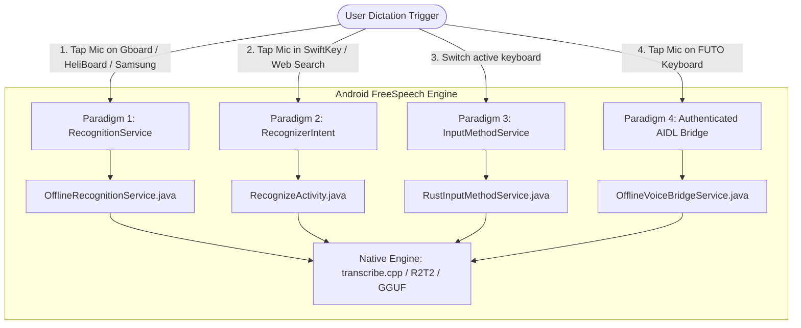

# The Android RecognitionService Situation: System Speech-to-Text Architecture & Fork Analysis

This document provides a comprehensive technical analysis of the **Android Speech Recognition Service situation**, focusing on **Issue #39** in upstream `notune/android_transcribe_app`, the pioneering implementation by **Johannes Schindelin (`dscho`)**, and how the four competing Android speech-to-text paradigms interact in **Android FreeSpeech** (`https://github.com/NairoDorian/Android_FreeSpeech`).

---

## 1. Executive Summary & Context

On modern Android devices, users expect offline speech recognition to integrate seamlessly into their workflows: tapping the microphone key on any keyboard (Gboard, Samsung Keyboard, SwiftKey, HeliBoard), using accessibility tools (screen readers, dictate shortcuts), or voice typing in third-party apps (Duolingo, note-taking apps).

However, Android's speech recognition architecture is historically fragmented into **four fundamentally different paradigms**:
1. **System Speech-to-Text Provider** (`android.speech.RecognitionService`)
2. **Activity Intent Chooser** (`RecognizerIntent.ACTION_RECOGNIZE_SPEECH`)
3. **Input Method Service** (`android.inputmethodservice.InputMethodService`)
4. **Custom Authenticated IPC Bridges** (e.g., FUTO AIDL Voice Bridge)

Understanding the differences, limitations, and implementation nuances of these paradigms is critical to making **Android FreeSpeech** the premier universal offline speech engine on Android.

---

## 2. Upstream Issue #39: The Catalyzer

- **Issue Link**: [notune/android_transcribe_app#39: "FR: Implement recognition service"](https://github.com/notune/android_transcribe_app/issues/39)
- **Status**: Opened in upstream repository; heavily discussed by community and assistive-technology users.

### 2.1 The Core Request
Community members (led by user `peter`) noted that while `android_transcribe_app` had an exceptional offline STT engine (outperforming cloud and local alternatives in speed and accuracy), it was trapped inside its own standalone keyboard UI or popup activity.

The user request stated:
> *"Since this model outperforms whisper and many others in terms of speed and efficiency, it would be very useful to also implement recognition service so it can be selected as the default speech to text provider within android system settings (`Settings -> System -> Languages -> Speech-to-text`).*
>
> *The idea is that recognition service has just a settings activity... and the recognition process itself has no UI and the controlling app takes care of it.*
>
> *For example my use case is that I am using a screen reading app combined with other assistive tools called Corvus and for example with whisper I can just long press the volume button and dictate my text. It's very powerful. Additionally other open-source and closed source apps such as Corvus, Duolingo and many others can make use of it."*

### 2.2 Parallel Ecosystem Struggles
The issue pointed out that nearly every open-source speech project on Android had faced this exact request:
- [whisperIME Issue #53](https://github.com/woheller69/whisperIME/issues/53): Request for system-level speech service.
- [FUTO Voice Input Issue #7](https://github.com/futo-org/voice-input/issues/7): Requests for `RecognitionService` support for non-FUTO keyboards.
- [Sayboard Issue #54](https://github.com/ElishaAz/Sayboard/issues/54): Discussion on headless background speech recognition.

---

## 3. The Four Android Speech-to-Text Paradigms



### Detailed Paradigm Comparison

| Feature / Metric | 1. `RecognitionService` | 2. `RecognizerIntent` | 3. `InputMethodService` | 4. AIDL Bridge (FUTO) |
|---|---|---|---|---|
| **System Setting** | `Settings -> System -> Speech-to-text` | Default Intent Resolver | `Settings -> System -> Keyboards` | App-specific pairing token |
| **UI Presentation** | Headless (Calling app draws UI or OS default) | Fullscreen / Dialog Activity Popup | Complete virtual keyboard view | Seamless in-keyboard UI |
| **Trigger Mechanism** | `SpeechRecognizer.startListening()` | `startActivityForResult(ACTION_RECOGNIZE_SPEECH)` | IME switch button on spacebar | Custom AIDL Binder IPC RPC |
| **Client Requirements** | Standard Android SDK API | Standard Android Intent API | Requires user keyboard swap | Requires client custom code |
| **Streaming Support** | Supported via `RecognitionListener.onPartialResults()` | None (Delivers only final result on finish) | Supported via `setComposingText` | Supported via `IOfflineVoiceBridgeCallback` |
| **Audio Metering** | Native `onRmsChanged(float rmsdB)` | None or internal to dialog | In-keyboard visualizer | Custom IPC callback |
| **Android 14 Friction** | High (Caller vs Service FGS eligibility) | Low (Foreground activity) | Low (Visible window) | Solved via `PendingIntent` trampoline |

---

## 4. Johannes Schindelin's (`dscho`) Implementation

- **Fork Comparison**: [`notune/android_transcribe_app...dscho:android_transcribe_app:main`](https://github.com/notune/android_transcribe_app/compare/main...dscho:android_transcribe_app:main)
- **Local Clone**: `other_forks/dscho`
- **Key Commits**:
  - `36953b5`: *"Implement an android.speech.RecognitionService"*
  - `e14cbd4`: *"mainactivity: add a Test RecognitionService button"*
  - `bdeb60e`: *"ime: stream dictation text while the user is recording"*
  - `c1156a3`: *"Streaming dictation: render the in-flight transcript as composing text"*

### 4.1 Architecture of `OfflineRecognitionService.java`
Located in [`app/src/main/java/dev/notune/transcribe/OfflineRecognitionService.java`](file:///c:/Users/Z/Downloads/PROJECTS/Android_FreeSpeech/other_forks/dscho/app/src/main/java/dev/notune/transcribe/OfflineRecognitionService.java):

```java
public class OfflineRecognitionService extends RecognitionService {
    @Override
    protected void onStartListening(Intent recognizerIntent, Callback listener) {
        // 1. Verify RECORD_AUDIO permission
        // 2. Query RecognizerIntent.EXTRA_PARTIAL_RESULTS
        // 3. Signal listener.readyForSpeech(Bundle.EMPTY)
        // 4. Delegate to Rust: startRecording(wantsPartials)
    }

    @Override
    protected void onStopListening(Callback listener) {
        stopRecording(); // Finalize current utterance
    }

    @Override
    protected void onCancel(Callback listener) {
        cancelRecording(); // Discard buffers
    }
}
```

### 4.2 Decibel Audio Metering
Android's `RecognitionListener` expects audio volume levels in decibels (`rmsdB`). `dscho` implemented standard logarithmic conversion:
```java
public void onAudioLevel(float level) {
    Callback cb = activeCallback;
    if (cb == null) return;
    float db = (level <= 0f) ? -80f : (float) (20.0 * Math.log10(level));
    if (db < -80f) db = -80f;
    if (db > 0f) db = 0f;
    try {
        cb.rmsChanged(db);
    } catch (RemoteException ignored) {}
}
```

### 4.3 Manifest & XML Discovery
For Android to recognize the service as a system speech provider, it must declare the standard intent filter and metadata descriptor:
```xml
<!-- AndroidManifest.xml -->
<service
    android:name=".OfflineRecognitionService"
    android:label="Offline Voice Input"
    android:permission="android.permission.BIND_RECOGNITION_SERVICE"
    android:exported="true">
    <intent-filter>
        <action android:name="android.speech.RecognitionService" />
        <category android:name="android.intent.category.DEFAULT" />
    </intent-filter>
    <meta-data
        android:name="android.speech"
        android:resource="@xml/recognition_service" />
</service>
```

And in `app/src/main/res/xml/recognition_service.xml`:
```xml
<?xml version="1.0" encoding="utf-8"?>
<recognition-service xmlns:android="http://schemas.android.com/apk/res/android"
    android:settingsActivity="dev.notune.transcribe.MainActivity" />
```

---

## 5. The Composing Text Breakthrough (`c1156a3`)

One of the most consequential contributions in `dscho`'s fork addresses **streaming live dictation in virtual keyboards**.

### The Problem with Token-Batch Streaming
In early streaming implementations:
1. When audio chunks were processed, new tokens were committed directly into the text field (`InputConnection.commitText`).
2. Because acoustic context shifts as words are spoken, early tokens often changed upon subsequent re-evaluation (e.g. the model first heard *"bag"*, but upon hearing the subsequent vowel decided the word was *"bank"*).
3. Committing tokens immediately resulted in duplicate or garbled text: *"bag bank"*.
4. Sliding buffer windows (discarding earlier audio to save CPU) caused the model to lose confidence at chunk boundaries, frequently dropping words at the end of an utterance.

### The Solution: Composing Text (`setComposingText`)
In commit `c1156a3`, `dscho` fundamentally restructured the IME streaming pipeline:
1. **Never-Truncated Cumulative Buffer**: Audio accumulates in an untruncated buffer throughout the utterance.
2. **Growing Acoustic Context**: Every 2 seconds (`UPDATE_INTERVAL_SAMPLES`), a worker re-transcribes the full accumulated audio. Because context grows steadily, word hypotheses stabilize rather than oscillating.
3. **Atomic Composing Text Updates**: The hypothesis is rendered via `InputConnection.setComposingText(hypothesis, 1)`. In Android's IME architecture, `setComposingText` atomically replaces any active composing region without modifying committed text.
4. **End-of-Utterance Commit**: When recording stops, one final pass is executed. The IME calls `InputConnection.finishComposingText()` and appends a trailing space, committing the finalized transcript cleanly.

---

## 6. Challenges & Real-World Pitfalls of `RecognitionService`

While `RecognitionService` is the standard Android contract, real-world deployment across Android 10–16 reveals distinct failure modes:

### 6.1 Android 14 Foreground Service Restrictions (API 34+)
On Android 14+, background services cannot start audio capture using `FOREGROUND_SERVICE_TYPE_MICROPHONE` without either:
- Having an active visible activity in the process.
- Receiving explicit foreground delegation from the calling app.
When a third-party app calls `SpeechRecognizer.startListening()`, Android may throw `ForegroundServiceStartNotAllowedException` if the `RecognitionService` attempts to launch a background microphone worker.

### 6.2 Process Concurrency & State Collisions
In apps that offer both an IME (`RustInputMethodService`) and a `RecognitionService`, both services share the same native inference process and model weights. If a user taps the mic in an app while the IME is active, both services may attempt to acquire the native recorder simultaneously. Strict serialization via mutex locks (such as `RECOG_SVC_STATE` and `VOICE_SESSION_STATE`) is mandatory to avoid audio device busy errors.

### 6.3 OEM Inconsistencies
- **Gboard**: Often ignores third-party `RecognitionService` providers entirely, binding only to Google Speech Services unless forced via custom ROMs or AOSP settings.
- **Samsung Keyboard**: Successfully binds to third-party `RecognitionService` implementations via its voice-input settings menu.
- **HeliBoard / FlorisBoard / AnySoftKeyboard**: Full support for third-party `RecognitionService` providers.

---

## 7. Architecture Roadmap for Android FreeSpeech

To make **Android FreeSpeech** the most robust speech engine on Android, we combine the best architectural solutions from all forks:

```
┌─────────────────────────────────────────────────────────────────────────────┐
│                       Android FreeSpeech Unified STT                        │
├───────────────────────────────┬─────────────────────────────────────────────┤
│ Component                     │ Proven Implementation Origin                │
├───────────────────────────────┼─────────────────────────────────────────────┤
│ System Speech Provider        │ dscho (OfflineRecognitionService.java)      │
│ IME Composing Text Streaming  │ dscho (commit c1156a3 setComposingText)     │
│ Android 14 FGS Trampoline     │ djurcola (ForegroundActivationDispatcher)   │
│ Native CPAL Context Bootstrap │ djurcola (ndk_context bootstrap)            │
│ Dynamic Audio Format Resample │ djurcola (CaptureConverter in audio.rs)     │
│ High-Speed Offline Inference  │ NairoDorian (transcribe.cpp v0.2.3+ & R2T2) │
└───────────────────────────────┴─────────────────────────────────────────────┘
```

By synthesizing `dscho`'s clean `RecognitionService` and composing text streaming with `djurcola`'s Android 14 resilience and our own `transcribe.cpp` R2T2 engine, **Android FreeSpeech** provides complete coverage across all Android speech interfaces.
